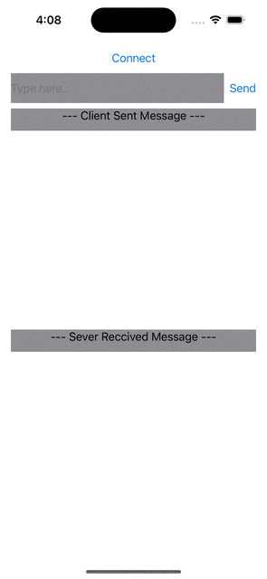

# MessageClientSever

*  Architecture MVVM - SwiftUI
   Basic Sever Client comm using Native Network framework.
   Where TCPSever & TCPClient both class used for connection

* Applied SOILD priciple:
 ex: Dependency inversion (DIP) used in MessageSever & MessageClient.
 
* Unit test for Sever connection.

* Step to Run

1.  Use Xcode 14.2, run
2.  Tap on Connect button , (It will run Sever & connect client)
3.  Type text (type here..) & press send button
4.  There is 2 List view , able to see Client & Sever messages.

 
